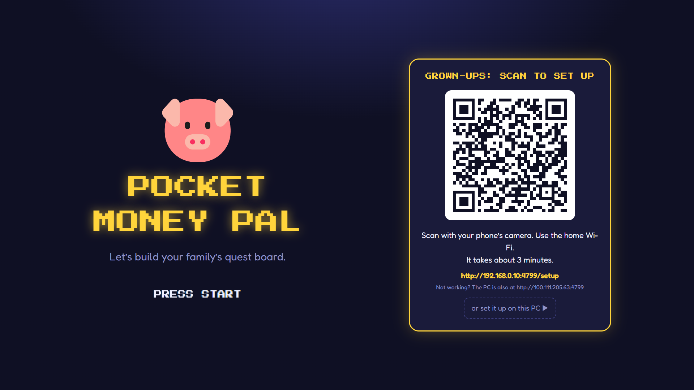
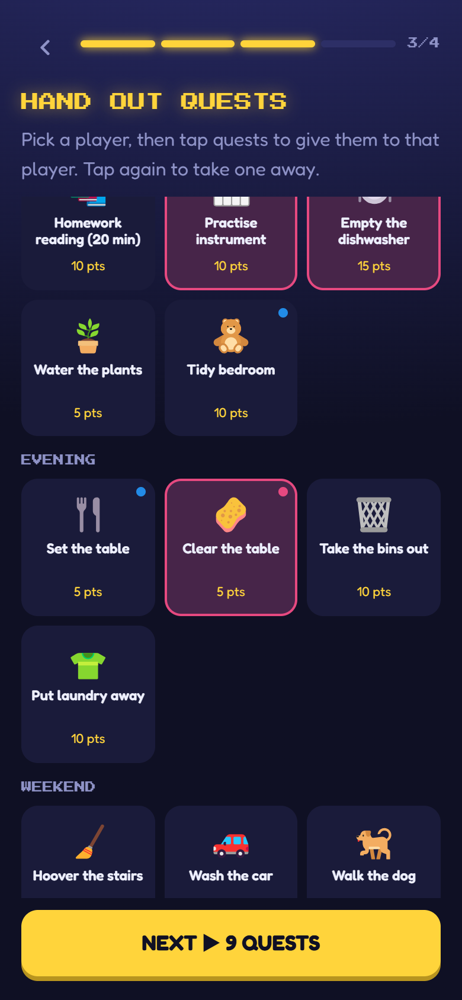
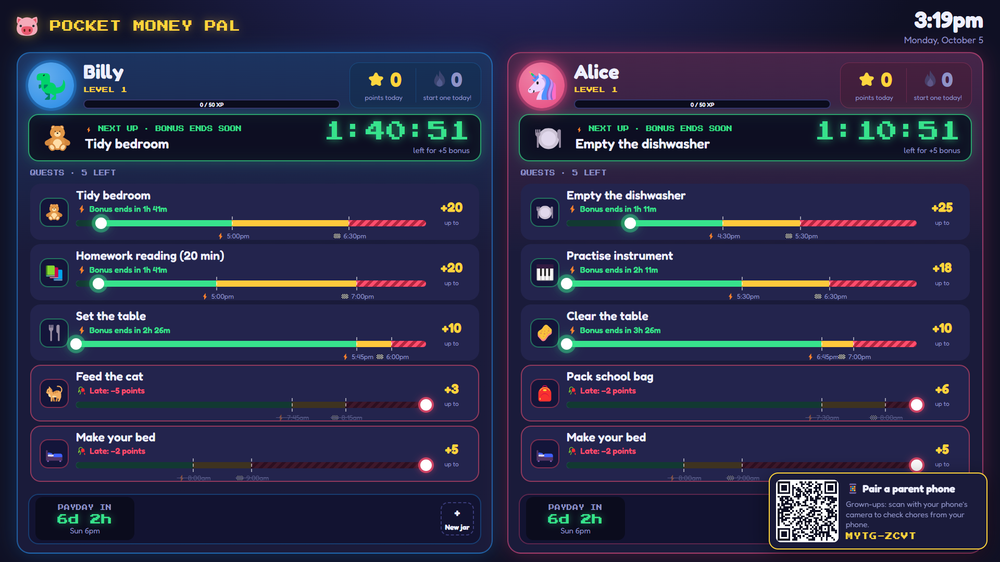

# Installing Pocket Money Pal

This guide takes you from download to a working quest board, with the kids' screen on the family PC and the grown-ups' app on your phones. It takes about 15 minutes, plus another 15 if you set up notifications.

Once it's running, the [user guide](user-guide.md) explains how to use it day to day.

## What you need

- **A Windows 10 or 11 PC** that's on whenever the kids are about. It runs the app and keeps the family's data; nothing goes to the cloud.
- **A screen for the kids.** A second monitor works best, but the PC's only monitor works too. A touch screen is nice; a mouse is fine. The board is laid out for 1920×1080 or bigger.
- **The grown-ups' phones on the same Wi-Fi** as the PC. Android with Chrome is what we use and test on; iPhones haven't been tried yet.

## 1. Download and install

1. Go to the [Releases page](https://github.com/chris-hammond-ross/pocket-money-pal/releases) and download `Pocket-Money-Pal-Setup-<version>.exe` from the newest release.
2. Run it. Windows will probably show a blue **"Windows protected your PC"** box. That's SmartScreen: it warns about any program that hasn't been signed with a paid certificate, and this one isn't yet. Click **More info**, then **Run anyway**.
3. Go through the installer. The defaults are fine. It installs for your Windows user only, so it never needs admin rights to update itself.
4. Near the end, a message says Windows will ask about **Network Command Shell**. Choose **Yes** when it does. That adds a firewall rule so phones on your home network can reach the PC. It's the only time the app asks for admin rights. If you choose No, phones won't be able to connect; run the installer again to get the question back.

When it finishes, Pocket Money Pal starts. A pig icon appears in the system tray (by the clock), and the kids' screen opens full screen.

From now on the app starts when Windows starts. To change that, right-click the tray icon and untick **Start when Windows starts**.

## 2. First-run setup

The first time it runs, the kids' screen shows a title screen with a QR code.



Scan the code with your phone's camera (the phone must be on the home Wi-Fi), or click **or set it up on this PC** to do it on the PC. Setup has four short steps:

1. **Game masters:** the grown-ups' names.
2. **Players:** each child's name, age, avatar and colour.
3. **Hand out quests:** pick a child, then tap the chores they should do. The suggestions come with sensible times and points; you can fine-tune them later.
4. **Today's board:** a preview of today, and the **loot rate**: what one point is worth in money (5¢ to start).



Tap **START THE GAME** and the board appears on the kids' screen. If you did setup on your phone, that phone is now paired to the first grown-up. A half-finished setup is saved as you go, so a reload doesn't lose it.

## 3. Choose the kiosk screen

The kids' screen opens on your second monitor if you have one, otherwise on the main one. To move it, right-click the tray icon and pick one under **Kiosk screen**. It moves straight away and stays there after a restart. If that monitor is unplugged, the app goes back to its usual choice.

Other things in the tray menu:

- **Open** brings the kids' screen back if someone closed it. Closing it doesn't stop the app: phones keep working.
- **Restart** restarts the app.
- **Quit** stops it completely, and phones can't connect until it's started again.

While it's running, the app stops the screen from going to sleep.

## 4. Connect parents' phones

Every grown-up action happens on a paired phone: approving chores, editing quests, payday, gifts. The kids' screen has no grown-up mode.

### On the home Wi-Fi

- **The first phone**, if you did setup on the PC: the kids' screen shows a **Pair a parent phone** card with a QR code. Scan it, tap your name, and you're in. The card goes away once a phone is paired.
- **Every other phone:** on a phone that's already paired, go to **Players**, tap **Pair another phone**, and scan the code it shows with the new phone (or type the code in). A code works once, for 10 minutes.



The phone opens an address like `http://192.168.1.20:4789/parent`. Add it to your home screen from the browser menu so it's one tap away.

This works as an ordinary web page. To get **notifications when a child finishes a chore**, an **app icon without the browser bar**, and the ability to **plan quests while the PC is off**, set up Tailscale as below.

### Secure access with Tailscale

Phones only allow notifications and installed web apps over a secure (HTTPS) address. [Tailscale](https://tailscale.com) gives the PC one for free, reachable only by your own devices, at home or away. It's optional: everything else works without it. These are the steps we used on Windows 11 and an Android phone with Chrome.

1. **Install Tailscale on the PC** from [tailscale.com/download/windows](https://tailscale.com/download/windows). If the installer ends with a long "Unable to set up Tailscale client" message about `Shell_NotifyIcon`, click OK: only its tray icon failed to start, and Tailscale itself is running.
2. **Sign in.** Open Tailscale from the Start menu and log in with the account that will own your private network (Google, Microsoft, GitHub and others work).
3. **Turn on HTTPS.** In the Tailscale admin console, open [DNS](https://login.tailscale.com/admin/dns), check **MagicDNS** is on, and click **Enable HTTPS** under HTTPS Certificates. The **Machines** page shows the PC's name; you can rename it there, for example to `family-pc`.
4. **Point Tailscale at Pocket Money Pal.** With Pocket Money Pal running, open PowerShell and run:

   ```powershell
   & "C:\Program Files\Tailscale\tailscale.exe" serve --bg 4789
   ```

   It prints the PC's secure address, something like `https://family-pc.tail1234.ts.net`, and keeps serving it after restarts. Open `https://family-pc.tail1234.ts.net/kiosk` on the PC once: that fetches the certificate (it can take a few seconds) and tells Pocket Money Pal its secure address.

5. **Install Tailscale on each grown-up's phone** from the Play Store, sign in with the **same account**, and leave it connected. It only carries traffic for your own devices, so the rest of the phone's internet is unaffected.
6. **Move each phone across.** On a paired phone, go to **Players** and tap **Switch to secure app**. It opens the secure address with a one-time code; tap your name. (A phone that isn't paired yet can open the secure address's `/parent` page directly and pair with a code from another phone.)
7. **Install the app and turn on notifications.** The app asks once whether to notify this phone; tap **Yes, notify this phone** and allow notifications. Install it with **Install** at the top of the Players tab, or Chrome's menu, then **Install app**. It appears as **Money Pal**.

Good to know:

- No notifications are sent during **quiet hours** (8pm to 7am unless you change them on the Players tab).
- Several chores finished within two minutes arrive as one notification.
- Notifications go through Google's push service, so the PC needs to be online for them. Everything else stays on your network.
- On Samsung phones the installed app doesn't appear in Settings > Apps. It's still installed: Chrome lists it at `chrome://webapks`.

## Backup and restore

Everything the family has made lives in one folder: `%APPDATA%\Pocket Money Pal` (paste that into File Explorer's address bar).

**To back up:**

1. Right-click the tray icon and choose **Quit**.
2. Copy `pmp.db` from that folder, along with `pmp.db-wal` and `pmp.db-shm` if they're there, and the `images` folder if there is one (jar pictures).
3. Start Pocket Money Pal again from the Start menu.

**To restore:** quit the app, put the copies back in the same folder (replacing what's there), and start it again.

There's also a **Factory reset** at the bottom of the phone's Players tab, for starting again from scratch. It can't be undone, so take a backup first if you might want the old data back.

## Updating

Updates install themselves. The app checks for a new version every few hours and downloads it in the background. It installs at about 3am, or straight away if the PC has only just started. To install a downloaded update now, choose **Restart to update** in the tray menu. Phones and the kids' screen pick up the new version by themselves.

The version you're running is shown at the bottom of the phone's **Players** tab.

## Uninstalling

Go to **Settings > Apps**, find **Pocket Money Pal**, and choose **Uninstall**. Windows asks once more for permission, to remove the firewall rule.

The family's data in `%APPDATA%\Pocket Money Pal` is kept, in case you reinstall. Delete that folder to remove everything. If you set up Tailscale, run `tailscale serve --https=443 off` to stop serving the address, or uninstall Tailscale itself.

## Troubleshooting

- **A phone can't connect** (the page loads forever): check the phone is on the same Wi-Fi as the PC, and not a guest network, which routers usually keep apart. On the phone, open `http://<pc-address>:4789/api/health`; it should show `"ok":true`. If it doesn't, the firewall rule may be missing: run the installer again and choose Yes to the Network Command Shell question.
- **"Pocket Money Pal could not start"** or **"The server stopped unexpectedly"**: another copy is probably running. Quit it from the tray and try again.
- **The kids' screen is on the wrong monitor:** see [Choose the kiosk screen](#3-choose-the-kiosk-screen).
- **Something else:** the app writes a log to `%APPDATA%\Pocket Money Pal\desktop.log`. Please include it if you [open an issue](https://github.com/chris-hammond-ross/pocket-money-pal/issues).

## Running from source

For developers. You need Windows 10 or 11 (the server also runs on macOS and Linux, but the kiosk app and installer are only tested on Windows), [Node.js](https://nodejs.org) 22 or newer, and Git.

```bash
git clone https://github.com/chris-hammond-ross/pocket-money-pal.git
cd pocket-money-pal
npm install

npm run dev            # server on :4789 and Vite on :5173, with hot reload
npm run build          # build everything, then:
npm start              # serve it all on http://localhost:4789
npm run desktop:dev    # build and open the kiosk window (Electron)
npm run desktop:dist   # build the Windows installer into apps/desktop/release/
```

In development, open http://localhost:5173/kiosk on the PC and `http://<pc-address>:5173/parent` on a phone. Phones need a firewall rule for the port; in PowerShell as administrator:

```powershell
netsh advfirewall firewall add rule name="Pocket Money Pal" dir=in action=allow protocol=TCP localport=4789 profile=any remoteip=localsubnet
```

Use `localport=5173` too for `npm run dev`. Use `profile=any`, not a Private-only rule: on a PC with VirtualBox, Hyper-V or VPN adapters, Windows can judge the home network as Public, and phones then time out with nothing in the firewall log.

**Data:** `npm start` and `npm run dev` use `apps/server/data/pmp.db`; the kiosk app (dev or installed) uses `%APPDATA%\Pocket Money Pal\pmp.db`. Migrations run when the server starts.

**Settings** are environment variables, none of them required:

| Variable            | Default                           | What it does                                                                             |
| ------------------- | --------------------------------- | ---------------------------------------------------------------------------------------- |
| `PMP_PORT`          | `4789`                            | Port the server listens on.                                                              |
| `PMP_HOST`          | `0.0.0.0`                         | Address to listen on. `127.0.0.1` keeps it off the network.                              |
| `PMP_DB_PATH`       | see above                         | Path of the database file.                                                               |
| `PMP_LOG_LEVEL`     | `info`                            | Server log level.                                                                        |
| `PMP_PUBLIC_URL`    | guessed LAN address               | Address phones use in the setup QR code, if the guess picks the wrong network adapter.   |
| `PMP_SECURE_URL`    | learned                           | The HTTPS address for "Switch to secure app", if you'd rather not let it be learned.     |
| `PMP_VAPID_SUBJECT` | `mailto:pocketmoneypal@localhost` | Contact address push services see with notifications.                                    |
| `PMP_DISPLAY`       | the tray's choice                 | Kiosk app only: the monitor index (`0`, `1`, …). Overrides the tray's Kiosk screen menu. |
| `PMP_KIOSK`         | off                               | Kiosk app only: `1` locks the window in kiosk mode.                                      |
| `PMP_SERVER_URL`    | bundled server                    | Kiosk app only: use an already-running server, e.g. `http://localhost:5173`.             |

When running the installed exe from a VS Code terminal, clear `ELECTRON_RUN_AS_NODE` first, or it silently does nothing.

**Publishing a release:** push a version tag (`git tag v0.2.0 && git push origin v0.2.0`). The Release workflow sets every package's version from the tag, runs the checks, builds the installer and publishes it on GitHub. Installed copies update themselves within a few hours.
