# Using Pocket Money Pal

A short guide for grown-ups. It assumes the app is installed and set up ([installation guide](installation.md)) and your phone is paired.

## How it works

- Chores are **quests**. Each has a time window: finish early for a bonus, on time for the normal points, or late and lose a few.
- The kids tap a quest on the **kiosk** (the family PC's screen) when it's done. You check it on your **phone** and approve it, and the kiosk celebrates.
- Quests earn **points**. Once a week, at **payday**, points turn into **money** at the rate you set, and each child pours it into **jars**, one for each thing they're saving for.
- Doing every quest every day builds a **streak**, and points add up to **levels**.

The phone app has four tabs: **Day**, **Week**, **Players** and **Payday**.

## Setting up quests

The **Day** tab shows a day's quests on a 6am to 9pm timeline. Each bar shows the quest's window: green for the early bonus, yellow for on time, orange for overdue (no penalty yet), and red for late. On today, a white line marks the time and each child's avatar shows when they finished.

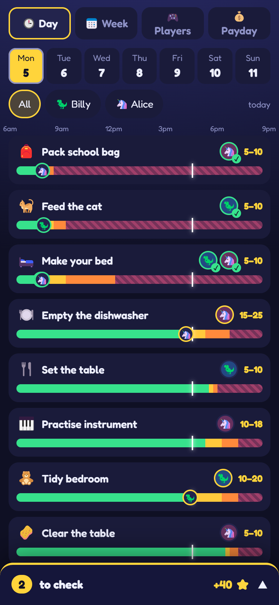

- **Add a quest:** tap **+ New quest** at the bottom of the list. Pick a suggestion, **Make my own**, or a **one-off** for just that day (handy for "wash the car on Saturday").
- **Change a quest:** tap it. In the quest editor you can:
  - choose its players. With two or more, **Together?** makes it one shared job, and each child gets the points;
  - drag the three markers: when the bonus ends, when it's due, and when it becomes late. They snap to 15 minutes. The **Morning / Midday / Afternoon / Evening** buttons move the whole window at once;
  - set the **loot**: points for doing it, the early bonus, the bonus for doing it without being asked, and the points lost for being late. The line underneath shows what that's worth in money;
  - pick the days it runs.
- **Today only:** the editor's TODAY section can mark it done for a child, **skip today only**, or put it back.
- **Delete** is at the bottom of the editor and needs a second tap. Points already earned stay.

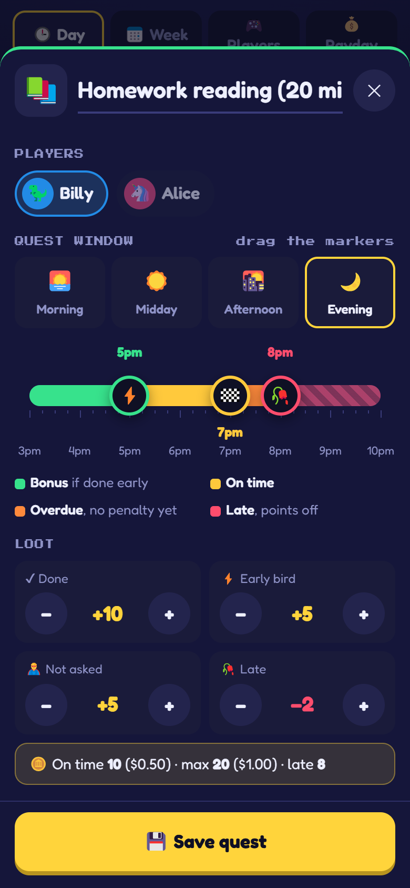

The **Week** tab is a grid of quests and days. Tap a square to switch a quest on or off for that day. Below it, each child's weekly points show what they can earn.

Changes reach the kiosk straight away, including today's quests.

**Going away?** At the bottom of the Week tab, **Pause quests** stops every quest from today or tomorrow, for 3 days, a week, 2 weeks, until a date you pick, or until you resume. Nobody's streak breaks, payday waits, and the kiosk shows a holiday screen.

## Approving

When a child finishes a quest, a **to check** tray appears at the bottom of every tab. Tap it to open it.

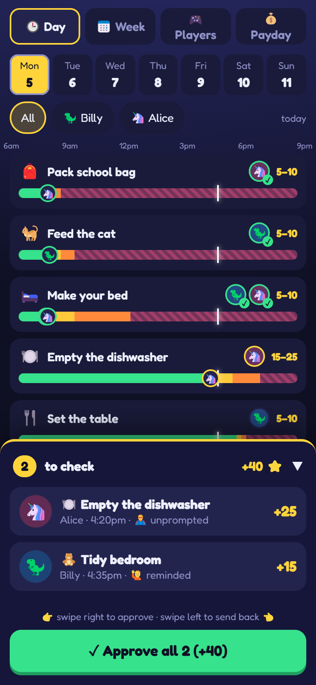

- **Swipe right** to approve. The kiosk plays a coin and the points fly up.
- **Swipe left** to send it back, with a reason: not finished, needs a redo, let's do it together, or didn't happen. The child sees your note on the quest, and can tap it again once it's really done.
- **Approve all** does the lot.
- **Tap a card** to open the quest, with the same choices in its TODAY section.

Points are worked out when the child taps the quest, so an evening approval doesn't cost anyone their early bonus. Approved something by mistake? Open the quest and tap **Undo** in TODAY: the points come back off.

If the child did the quest but forgot to tap it, open the quest and use **Mark done**.

With notifications on ([installation guide](installation.md#secure-access-with-tailscale)), your phone tells you when there's something to check.

## Bonuses, sick days and settings

The **Players** tab has a card for each child: their streak, quests, points today and money saved.

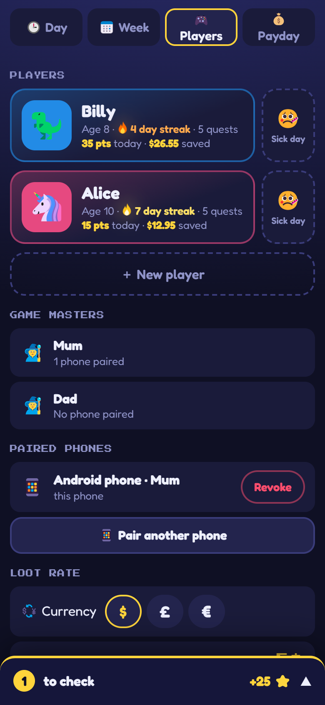

- **Bonus points:** the **+5**, **+10** and **−5** buttons further down give or take points straight away, for anything you like. The kiosk shows them land. They count towards payday but not towards levels.
- **Sick day:** the button next to a child's card skips all their waiting quests today, so their streak is safe. Tap **Undo** to bring them back.
- **Players:** tap a card to change a child's name, age, avatar or colour, or to remove them. **+ New player** adds one.
- **Loot rate and currency:** what one point is worth. A new rate only applies from then on.
- **Quiet hours** (8pm to 7am to start): no notifications, and no sounds on the kiosk. Animations still play.
- **Kiosk sounds:** the kiosk's volume.
- **Paired phones:** pair another grown-up's phone, or revoke a lost one.

## Payday, jars and gifts

Points become money once a week. On the **Payday** tab, choose the **day** and **time**, and **how it starts**:

- **By itself on the kiosk** (the default): at payday time the kiosk plays the payday show.
- **When I press start:** your phone tells you it's payday, and the show starts when you tap **Start payday now**, for example when everyone's home.

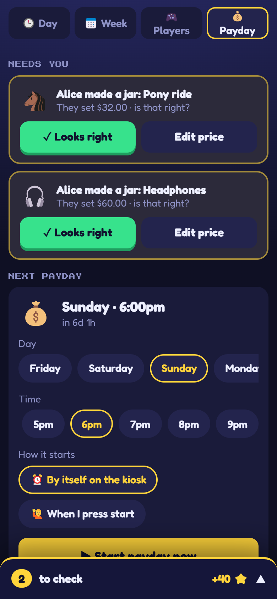

During the show, each child's points count down into money, then they hold their jars to pour coins in. Whatever they don't pour stays **to sort** for later.

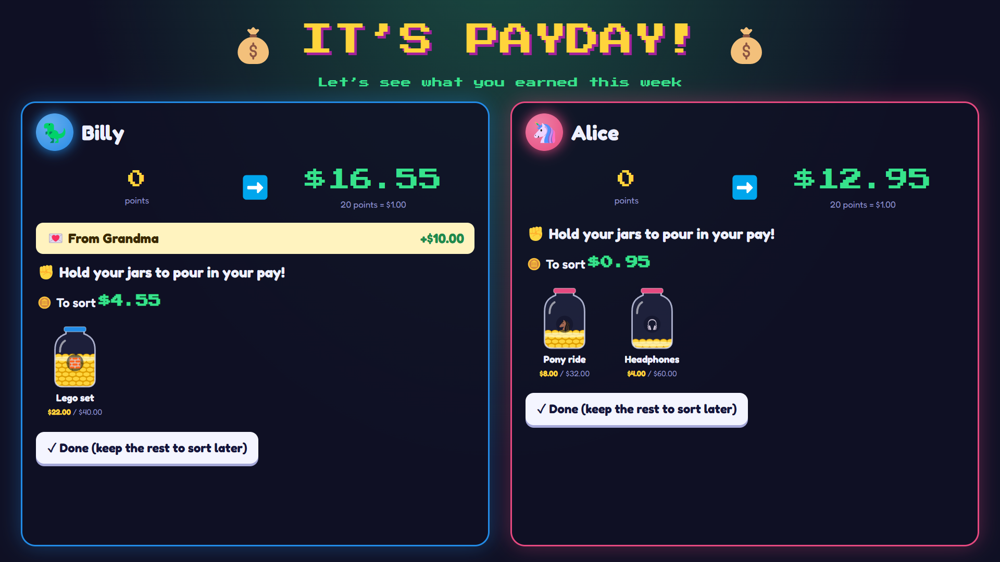

**Jars** are what the kids are saving for. They can make their own on the kiosk; the price they set shows under **Needs you** on the Payday tab for you to check (**Looks right**, or **Edit price**). When a jar is full, the child can smash it on the kiosk, and the Payday tab asks you to buy the thing: **Bought it** takes the money out of their savings, and **Put it back** leaves the jar as it was.

Tap a child on the Payday tab for their money page:

- **Gift** sends money as an envelope (birthday money, the tooth fairy, Grandma). The child opens it on the kiosk with a little fanfare.
- **Spent** records money going out, from "to sort" or from a jar.
- **+ New** makes a jar for them, with a shop link if you like (the PC fetches its picture).
- The **savings book** lists every payday, gift and purchase.

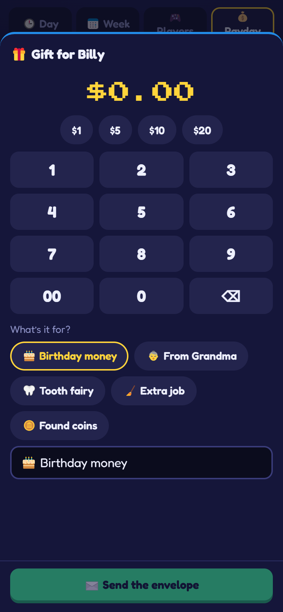

## Surprise quests

A surprise quest pops up full screen on the kiosk, and the kids race to grab it. Tap **Surprise quest** at the bottom of today's Day tab:

1. **Which quest:** a saved one, or create a new one with its reward (keep it for next time if you like).
2. **Who can accept it:** all the children, or just one.
3. **When:** right away, or at a set time today.
4. **Time frame:** how long it stays up to be grabbed.

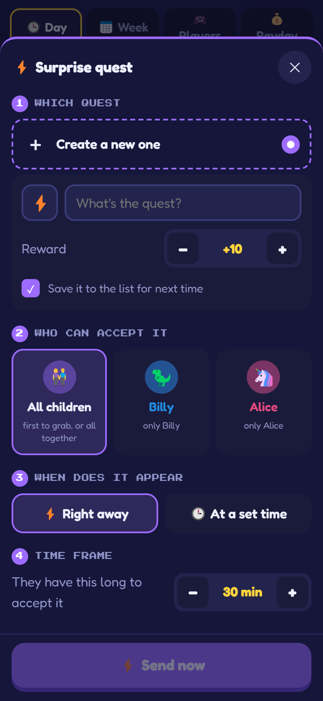

When it's for everyone, the kiosk also offers **We'll all do it!**, and each child gets the full reward. Whoever grabs it gets it as a quest on their column; they tap it when it's done, and it comes to your tray like any other. Today's surprises appear at the top of the Day tab, where you can take one back or send it again.

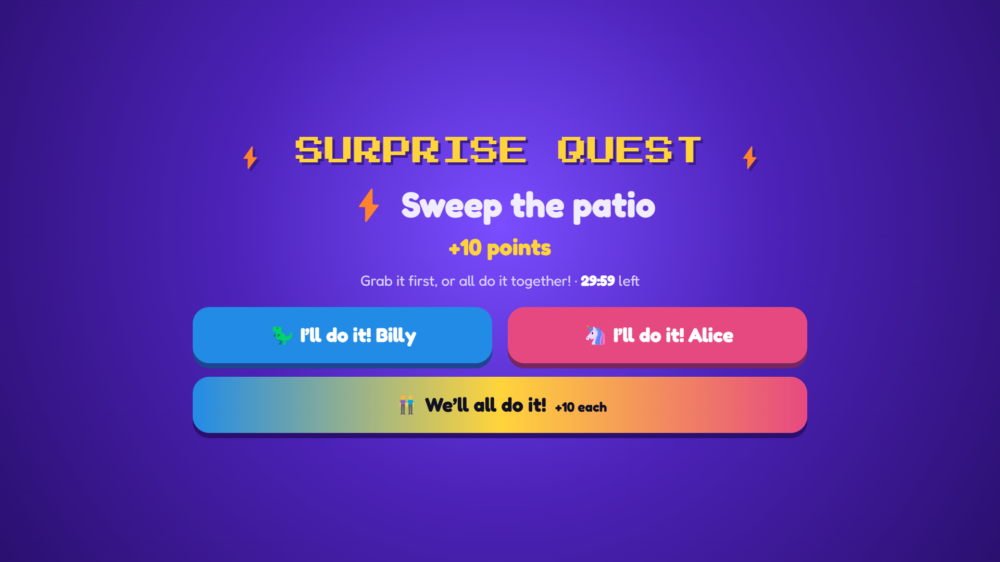

## What the kids see

The kiosk has a column for each child.

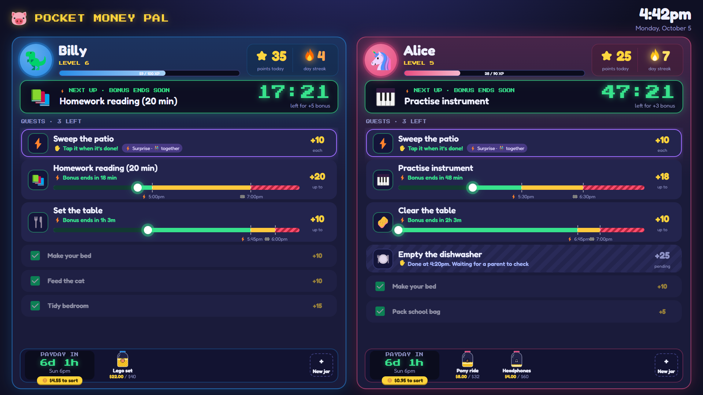

- **At the top:** their level and XP bar, points today, and their **streak flame**. The flame changes colour as the streak grows: orange, then yellow at a week, white at two weeks, then blue, green, purple and rainbow.
- **Next up:** the quest that needs doing soonest, with a big countdown.
- **Quests**, most urgent first. Each bar shows its window and where "now" is. A quest with five minutes of bonus left rings and ticks. Quests waiting for a grown-up are striped, and done ones are ticked at the bottom.
- **At the bottom:** the payday countdown and their first few jars. Tapping it opens their **savings screen**, where they can pour money into jars, make a new jar, or smash a full one.

To finish a quest, a child taps it and says whether they did it without being asked:

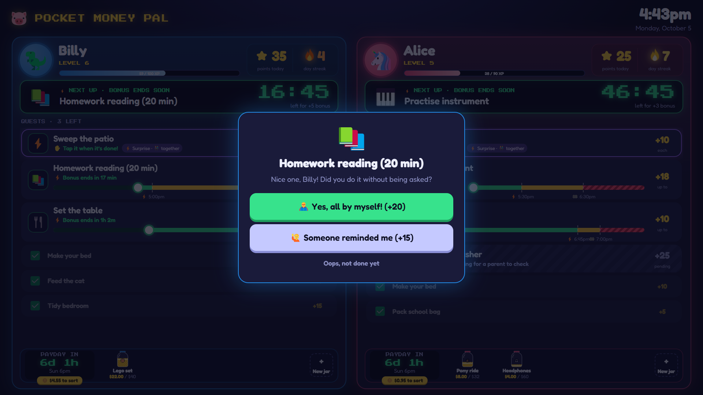

Each morning, a child whose streak changed overnight gets a short **morning report**: the flame grows, changes colour, or goes out (gently).

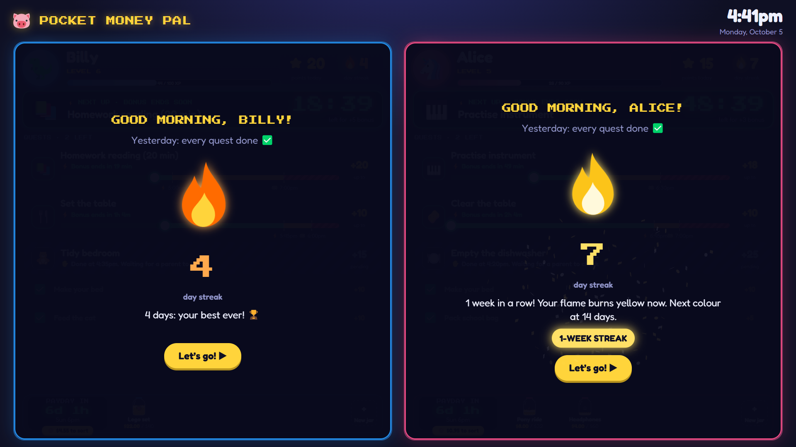

There's a big **level-up** moment when they reach a new level. During quiet hours the board turns to a night sky and stays silent.

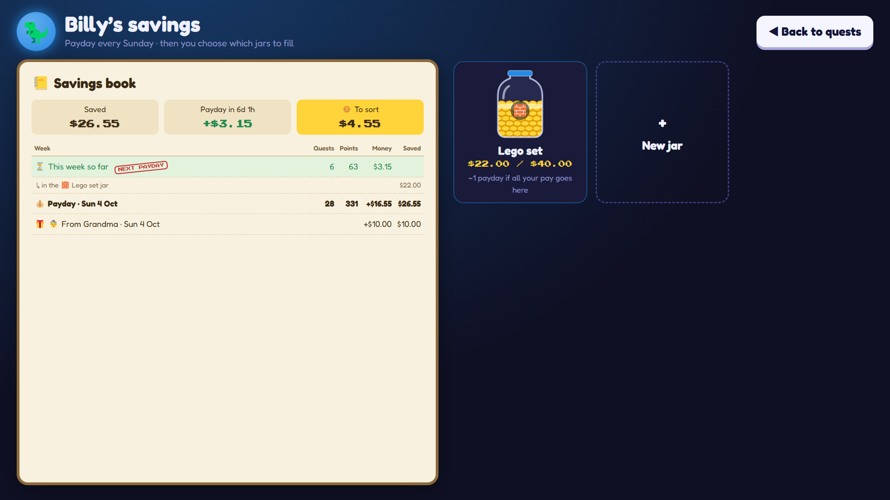

## When the PC is off

Everything lives on the family PC, so most things need it on. With the installed app over Tailscale ([installation guide](installation.md#secure-access-with-tailscale)), you can still **plan** while it's off: add, edit and delete quests, change the Week grid, and set up a holiday. The changes wait on your phone and are sent the next time you open the app with the PC on (sooner on Android, in the background). If another grown-up changed the same quest in the meantime, the app tells you whose change yours replaced.
